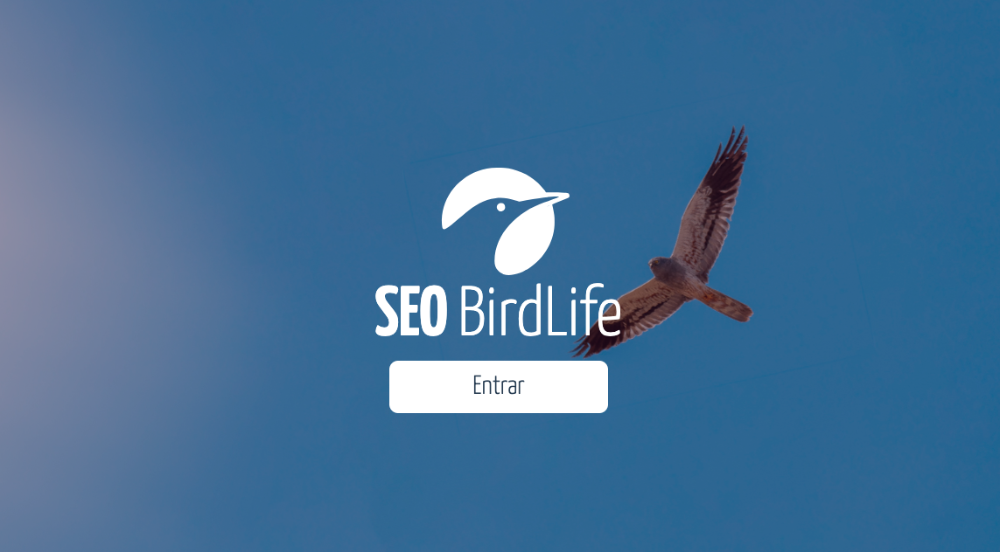
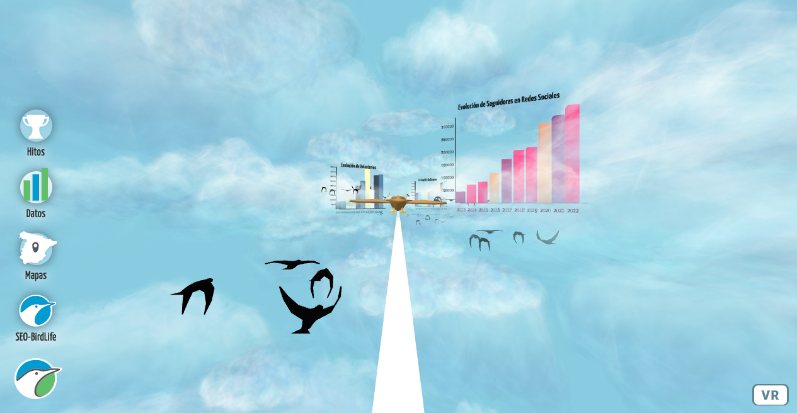
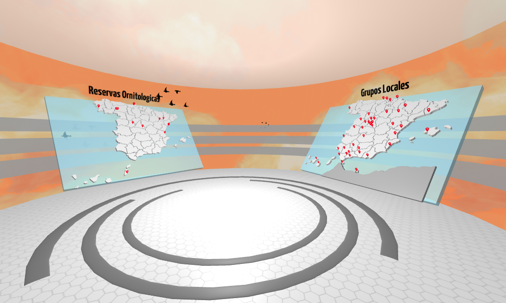
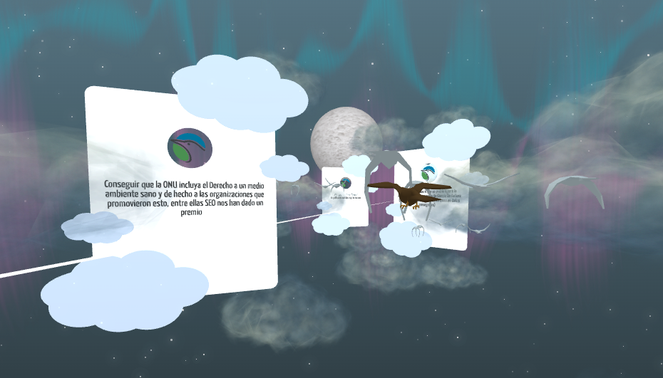

#  SEO Bird Life - Proyecto de Experiencia en A-Frame
	
(assets/img/logo.png)

"SEO Bird Life" es una experiencia interactiva desarrollada con A-Frame que combina elementos de gráficos, datos, mapas interactivos y una escena nocturna para resaltar los hitos de la empresa. Este proyecto está diseñado para proporcionar una experiencia envolvente y atractiva para los usuarios y presenta múltiples páginas.

# Participantes del Proyecto

-   **Scrum Master**: Santiago Andrade
-   **Product owner**: Alberto Diaz
-   **Web developer**:
    -   Bea Mendez
    -   Johan Gonzales
    -   Mariama Salhi

## Descripción

1.  **Entrada a la pagina principal**: La primera página es una entrada que facilita e acceso a cada una de las experiencias .

    
2.  **Escena de Gráficos y Datos**: La segunda página presenta una escena interactiva con gráficos y datos relevantes.

    
3.  **Escena de Mapas Interactivos**: La tercera página ofrece un conjunto de mapas interactivos que los usuarios pueden explorar para obtener información adicional.

    
4.  **Escena Nocturna de Hitos**: La cuarta página muestra una escena nocturna que resalta los hitos de tu empresa de una manera visualmente atractiva.

## Características Principales

-   Experiencia Responsive: "SEO Bird Life" es completamente responsive y se adapta a dispositivos móviles para que los usuarios puedan disfrutar de la experiencia en sus smartphones.
    
-   Usabilidad Móvil: La experiencia está diseñada pensando en la usabilidad móvil, lo que significa que los usuarios pueden interactuar de manera efectiva y cómoda en dispositivos móviles. 
    
-   Referencias e Ideas: Hemos incorporado ideas y conceptos inspirados en otras páginas y proyectos exitosos de experiencias interactivas para garantizar que "SEO Bird Life" sea atractivo y efectivo.

## Cómo Usar

1.  Clona este repositorio en tu máquina local.  (git clone https://github.com/AlbertoDiazEsteban/SEO-BirdLife_Frontend.git)    
3.  Abre el archivo `index.html` en tu navegador o utiliza un servidor web para servir el proyecto. (visual studio code )
4.  Navega a través del menu desplegable para explorar las diferentes escenas y características de "SEO Bird Life".

## Contribuciones

¡Las contribuciones son bienvenidas! Si deseas contribuir a este proyecto, sigue estos pasos:

1.  Haz un fork de este repositorio.
    
2.  Crea una nueva rama para tus cambios: `git checkout -b mi-nueva-funcion`.
    
3.  Haz tus cambios y realiza commits: `git commit -m 'Añadir nueva funcionalidad'`.
    
4.  Empuja tus cambios a tu repositorio en GitHub: `git push origin mi-nueva-funcion`.
    
5.  Crea un Pull Request para que revisemos tus cambios.

##  Referencias

Hemos tomado inspiración de las siguientes páginas y proyectos:

-   [Ejemplo de Página A-Frame]			(https://aframe.io/a-painter/)
-   [Proyecto de Experiencia Interactiva]	(https://www.behance.net/onboarding/adobe)
-   [Referencia de Usabilidad Móvil]		(https://www.audubon.org/)

